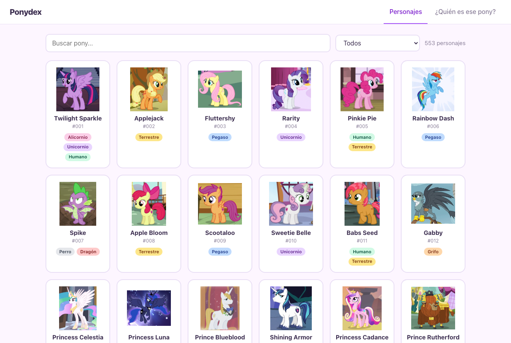

# Ponydex

Proyecto en React + TypeScript (Vite) que consume la [Pony API](https://ponyapi.net)
para mostrar los personajes de *My Little Pony: Friendship is Magic*.

## 🔗 Pruébalo

**https://misstery13.github.io/ponydex/**

No necesitas instalar nada: abre el enlace en el navegador y listo.



## Funcionalidades

- **Ponydex**: cuadrícula con todos los personajes, buscador por nombre y filtro por
  tipo (Earth, Pegasus, Unicorn, Alicorn...). Al hacer clic en una tarjeta se abre un
  modal con galería de imágenes, residencia, ocupación y enlace a la wiki.
- **¿Quién es ese pony?**: mini-juego. Se muestra un recorte de la imagen de un personaje y
  cuatro nombres; al elegir uno se revela la imagen completa y se suman puntos y racha.

## Cómo correrlo

```bash
npm install
npm run dev
```

Abre http://localhost:5173 en el navegador.

## Estructura

```
src/
├── api.ts                    # Llamada fetch a la API
├── tipos.ts                  # Tipos TypeScript de la respuesta
├── traducciones.ts           # Diccionario inglés → español de los tipos
├── hooks/usePersonajes.ts    # Hook que carga los personajes (cargando / error)
├── componentes/
│   ├── Ponydex.tsx           # Buscador, filtro y cuadrícula
│   ├── TarjetaPersonaje.tsx  # Tarjeta de un personaje
│   ├── ModalPersonaje.tsx    # Detalle en modal
│   └── JuegoAdivina.tsx      # Juego de adivinar
├── App.tsx                   # Pestañas y estructura general
├── App.css / index.css       # Estilos
```

## API usada

- `GET https://ponyapi.net/v1/character/all?limit=1000` → lista de personajes.

## Despliegue

El sitio se publica automáticamente en GitHub Pages con cada `push` a `main`
(ver `.github/workflows/deploy.yml`).

---

Creado por Diana Melena.
